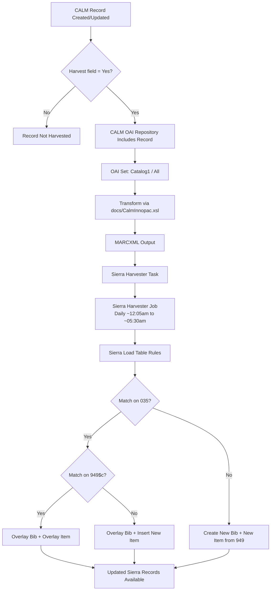

# CALM to Sierra Harvester Flow

## Purpose
This document describes how records move from CALM into Sierra for requesting and closed-stack workflows.

## Scope
The flow covers:
- CALM record eligibility (Harvest flag)
- OAI-PMH exposure and transformation
- Sierra harvester scheduling and execution
- Sierra load table behavior for bib and item create/overlay logic

## End-to-End Flow Summary
1. A cataloguer sets the CALM local field **Harvest** to `Yes` on records that should be exported.
2. The CALM OAI repository publishes only eligible records through the configured set.
3. The configuration settings for the OAI repository (on wt-CALM at Start>Programs>Axiell>OAI Suite>OAI Server Configuration) ensure that only records with the status of ‘Harvested’=Yes should be made available to external harvesters via the OAI repository: 
4. The OAI layer applies [docs/CalmInnopac.xsl](docs/CalmInnopac.xsl) to transform CALM metadata into MARCXML.
5. Sierra Harvester Task pulls records from the CALM OAI endpoint (set + format + match parameters).
6. A scheduled Sierra Harvester Job runs nightly and loads transformed records.
7. Sierra Load Table rules create or overlay bib/item records based on `035` and `949$c` matching.

## Mermaid Diagram

## Key Configuration Points
- CALM client label: **Harvest** (`Yes`/`No`), default is `No` for new records.
- Underlying CALM field reference noted in source: **Transmission** (label shown as Harvested in parts of the OAI setup).
- The criteria for harvest is further refined byOAI set definition source: `CalmDataSource.xml` with set id named as `Catalog1`.
- Calm Data source also specifies which stylesheet should be defined to transform data.[text](../../catalogue-pipeline/catalogue_graph/docs/axiell-folio-upsert.md)
- Transform stylesheet: [docs/CalmInnopac.xsl](docs/CalmInnopac.xsl).
- Metadata format used for harvest: MARC21/MARCXML.

## Sierra Harvester Components
- **Task**: Data source endpoint, set, metadata format, overlay match point (CALM record identifier usage).
- **Job**: Active/inactive schedule and execution window.

## Sierra Load Table Decision Logic
- No `035` match: create bib and create item from `949`.
- `035` match and `949$c` match: overlay bib and overlay item.
- `035` match and no `949$c` match: overlay bib and add a new item.

## Operational Notes
- Harvest runs daily and may take several hours.
- A summary report is produced after completion.
- Any change to set rules or transform stylesheet can alter downstream bib/item behavior and should be tested before production rollout.
