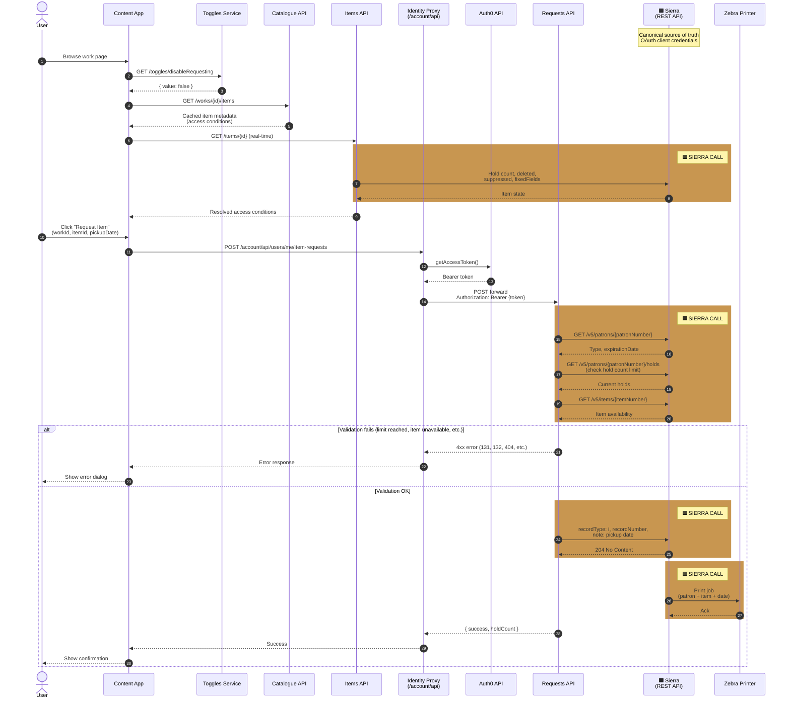

# Item Requesting Flow — Sequence Diagram

This diagram maps the Item Requesting Flow from [FULL-SYSTEMS-GUIDE.md](../FULL-SYSTEMS-GUIDE.md#3-item-requesting-flow-11-connections) onto a timeline, highlighting **every interaction with Sierra** (the canonical source of truth).

Sierra is called **four times** across the flow:
1. **Items API** queries for real-time item status
2. **Requests API** validates patron & item state (pre-create checks)
3. **Requests API** creates the HOLD record
4. **Sierra (internal)** triggers the Zebra printer on HOLD creation

## Sequence Diagram

## Sierra API Calls Summary

| # | Caller | Sierra Endpoint | Purpose | Response |
|---|--------|-----------------|---------|----------|
| 1 | Items API | `GET /v5/items/{itemNumber}` | Get item details (hold count, deleted, suppressed) | Item state with holdCount, deleted, suppressed flags |
| 2a | Requests API | `GET /v5/patrons/{patronNumber}` | Verify patron exists and check expiration | Patron type, expirationDate |
| 2b | Requests API | `GET /v5/patrons/{patronNumber}/holds` | Check current hold count (enforce 15-request limit) | List of current holds |
| 2c | Requests API | `GET /v5/items/{itemNumber}` | Re-verify item availability before creating hold | Item state with availability flags |
| 3 | Requests API | `POST /v5/patrons/{patronNumber}/holds/requests` | Create HOLD record with pickup date | 204 No Content or error (codes: 131=limit, 132=already held, 404=not found, etc.) |
| 4 | Sierra (internal) | Print trigger | Sierra automatically triggers Zebra printer on hold creation | Slip printed with patron + item + date |

## Sierra Calls

- **Items API queries** `GET /v5/items/{itemNumber}` on every page load — Catalogue API metadata is cached and cannot be trusted for live availability. Real-time hold count, deleted, and suppressed flags must come directly from Sierra.

- **Requests API validates before writing** — Three separate queries (`GET /v5/patrons/{patronNumber}`, `GET /v5/patrons/{patronNumber}/holds`, `GET /v5/items/{itemNumber}`) ensure:
  - Patron exists and hasn't expired
  - Patron is under the 15-request limit
  - Item still exists and is requestable (not deleted/suppressed)
  - By the time the user clicks Request, the cached page-load state may be stale.

- **Requests API creates the hold** — `POST /v5/patrons/{patronNumber}/holds/requests` writes the HOLD record atomically. On success (HTTP 204), Sierra immediately triggers the Zebra printer. Sierra error codes determine the response: `131` (limit reached), `132` (already held by another user), `404` (patron/item not found), `929` (duplicate race condition).

- **Sierra is the single writer** — HOLD records exist only in Sierra. No other service persists or manages request state, making Sierra authoritative.

## Key Points

- **Error path:** If validation fails (Sierra calls 2a–2c), specific HTTP status codes are returned before any HOLD is created:
  - Hold limit reached: `403 Forbidden` (Sierra code `131`)
  - Item already held by another user: `409 Conflict` (Sierra code `132`)
  - Patron/item not found: `404 Not Found` (Sierra code `404`)
  - User account expired: `403 Forbidden`

- **Atomic on Sierra:** Once `POST /v5/patrons/{patronNumber}/holds/requests` succeeds (HTTP 204), Sierra automatically triggers the Zebra printer. The physical slip prints with patron ID, item number, and requested pickup date before the response returns to the frontend.

- **Feature toggle:** The `disableRequesting` toggle (step in the flow) can block all requests at the frontend level, but the backend still validates using Sierra to be safe.

- **OAuth authentication:** All Sierra API calls use OAuth client credentials (X-Wellcome-Caller-ID header), not the user's session token.

## Related Documentation

- [FULL-SYSTEMS-GUIDE.md#3-item-requesting-flow](../FULL-SYSTEMS-GUIDE.md#3-item-requesting-flow-11-connections) — System architecture overview
- [discovery/requests-api-integration.md](./requests-api-integration.md) — Requests API technical integration details
- [item-requesting.md](../item-requesting.md) — User & staff workflows for requesting
